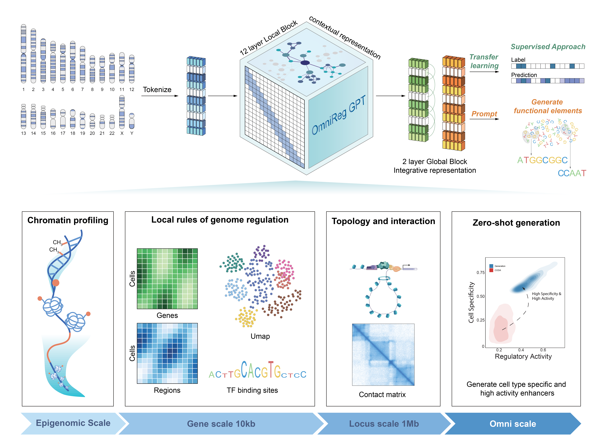

# OmniReg-GPT:A Large Window Foundation Model for Comprehensive Genomic Sequence Understanding

We developed a novel generative foundation model OmniReg-GPT, for the low-resource pretraining of long genomic seqeuences. OmniReg-GPT was based on hybrid attention architecture of local and global attention with 270 million parameters. Our experiments showed that OmniReg-GPT can serve as a foundation model for multi-scale gene regulation predictive tasks and functional elements generative tasks. It achieved exceptional performance in downstream applications spanning the entire spectrum of genomic scales, including predicting histone modifications, CpG methylation, transcription factor binding sites, context dependent gene expression, single-cell chromatin accessibility, 3D chromatin contact and generating cell-type-specific enhancers.

## Model weight and code
We provide model pretrained weight and code for how to fine-tune our model and generate functional elements.

<p align="center">
  
</p>

## Requirements and setup
OmniReg-GPT requires Python 3.8+ and Python packages Pytorch (>=2.0).

To experiment applications with OmniReg-GPT, please first run the following command to setup the environment:

```
# Clone this repository
git clone https://github.com/wawpaopao/OmniReg-GPT.git
cd OmniReg-GPT

# create 'OmniReg-GPT' conda environment by running the following:
conda create --name omnireg python=3.8
source activate omnireg

#conda install GPU version pytorch

# other packages
pip install accelerate einops scikit-learn transformers==4.33.0
```

## Training and Inference
To finetune or inference the OmniReg-GPT model or change some layers, you can refer to the example model code provided in the `finetune` folder.  You can specify hyperparameters such as batch_size, learning_rate and lr_schedule via `run.sh`. You can run `generation.py` to generate functional elements by prompt.

If you're facing GPU memory limitations, you can finetune only a part of the pretrained model by adding two lines in the model class.
```
for param in self.base_model.parameters():
            param.requires_grad = False
```


